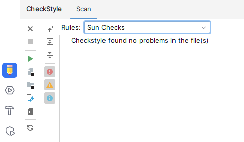
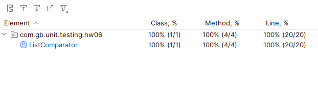

## Отчет о выполнении этого задания должен включать в себя следующие элементы:

### Код программы

```
GitHub
```

### Код тестов

```
GitHub
```

### Отчет pylint/Checkstyle



### Отчет о покрытии тестами



## Объяснение того, какие сценарии покрыты тестами и почему вы выбрали именно эти сценарии.

### Тесты написаны по тех.заданию.

Создайте программу на Python или Java, которая принимает два списка чисел и выполняет следующие действия

> Значит будет какой-то класс, и от него должен корректно создаваться объект.

> Тест **listComparator_Create_Test**

a. Рассчитывает среднее значение каждого списка.

> Тест **listComparator_AvgList1_Test**

> Тест **listComparator_AvgList2_Test**

> Тест, что списка только два **listComparator_AvgListException_Test**

b. Сравнивает эти средние значения и выводит соответствующее сообщение:

""Первый список имеет большее среднее значение"", если среднее значение первого списка больше.

> Тест **listComparator_AvgList1Bigger_Test**

""Второй список имеет большее среднее значение"", если среднее значение второго списка больше.

> Тест **listComparator_AvgList2_Test**

""Средние значения равны"", если средние значения списков равны.

> Тест **listComparator_AvgEquals_Test**
